# Mermaid Diagram Guidance for Agent Context Engineering

**Version**: 1.0  
**Date**: 2025-01-latest  
**Status**: Recommended Standard  

## Overview

Mermaid diagrams serve as **visual context engineering artifacts** to help agents quickly understand system structure, workflows, and decision trees without reading hundreds of lines of text. They are especially valuable for:

- **Architectural decisions**: Visualizing layers, boundaries, and component relationships
- **Workflow sequences**: Showing request-response flows, state transitions, and error paths
- **Decision trees**: Representing branching logic, validation gates, or multi-step processes
- **Dependency graphs**: Clarifying interactions between services, data flows, or API contracts

---

## Policy Recommendation

### When to Use Mermaid

**Recommended for Epics / Features with these tags**:
- `architecture`: System design, layering, facades, interfaces
- `workflow`: Request handling, state machines, transaction flows
- `integration`: Multi-component coordination, API contracts, message flows
- `decision`: Complex branching logic, validation rules, conflict resolution

**Optional for Tasks / Bugs** when:
- The task involves a significant refactor or new subsystem
- A diagram clarifies a previously ambiguous decision
- Multiple agents need shared understanding of the implementation approach

### When NOT to Use Mermaid

- Simple CRUD operations or data structure changes
- One-file changes or incremental refactors
- Tasks documented adequately in existing design specs
- Trivial diagrams (avoid "every class gets a diagram")

### Scope & Quality Bars

1. **Keep diagrams focused**: Represent one concern (architecture OR workflow, not both)
2. **Maintain readability**: A diagram readable in 30 seconds is worth 5 minutes of prose
3. **Use consistent terminology**: Align node labels with code identifiers and docs
4. **Avoid over-detail**: Show the "what" and "why", not every parameter or error code
5. **Prefer standardized shapes**: Use Mermaid's built-in syntax (graph TB, flowchart LR, sequence, state, etc.)

---

## Storage Convention

### Placement Rules

Store Mermaid diagrams in **product-local artifact directories** under `_kano/backlog/artifacts/`:

```
_kano/backlog/artifacts/
├── KABSD-FTR-0019/              # Feature: Refactor core + facades
│   ├── server-facade-design.md   # Store architecture diagram here
│   └── cli-migration-plan.md     # Store workflow diagrams here
├── KABSD-TSK-0120/              # Task: Remote collaboration
│   └── lease-conflict-flow.md    # Diagram of conflict resolution
└── KABSD-TSK-0130/              # Task: Mermaid guidance (this task)
    ├── mermaid-guidance.md       # This file (policy + guidance)
    ├── template-architecture.md  # Architecture diagram template
    └── template-sequence.md      # Sequence diagram template
```

### File Naming

- **Inline diagrams**: Keep in the backlog item's associated design doc (e.g., `server-facade-design.md`)
- **Standalone diagrams**: Create `<descriptive-name>.md` for complex visuals (e.g., `lease-conflict-flow.md`)
- **Linked in backlog items**: Reference via `[Diagram: Name](../artifacts/ITEMID/file.md)` in the backlog item itself

### Update Strategy

1. **Versioning**: Add diagrams incrementally; no need for version numbers—Markdown history via git tracks evolution
2. **Deprecation**: When diagrams become stale, update them or mark with `⚠️ OUTDATED` banner
3. **Cross-references**: If a diagram is referenced by multiple items, keep it in a shared artifact (e.g., `KABSD-FTR-0019/`)

---

## Mermaid Syntax Quick Reference

### Diagram Types Used in This Project

#### 1. **Architecture Diagrams (graph TB / LR)**
- Use for system layers, component relationships, request flow
- Nodes: `["name"]` for rectangles, `["fa:fa-icon Name"]` for icons, `|["name"]|` for database symbols

#### 2. **Sequence Diagrams**
- Use for request-response workflows, state transitions, multi-agent interactions
- Participants: CLI, HTTP Server, Service Layer, Core, Storage

#### 3. **State Diagrams**
- Use for backlog item states, state machine transitions, decision logic
- States and arrows: clear entry/exit conditions

#### 4. **Flowchart / Decision Trees (graph TD)**
- Use for validation gates, error handling paths, branching logic

---

## Template 1: Architecture Diagram (Layered System)

Use this template for **Epics** that introduce new facades or service boundaries.

**Markdown snippet** (copy into artifact file):

````markdown
# Architecture: [Component/System Name]

```mermaid
graph TB
    CLIENT["🌐 Client Layer<br/>(CLI / HTTP / MCP)"]
    
    subgraph FACADE["Facade Layer (Transport-Specific)"]
        HTTP["HTTP Server<br/>(FastAPI)"]
        MCP["MCP Server<br/>(Protocol)"]
    end
    
    subgraph MIDDLEWARE["Middleware / Concerns"]
        AUTH["Authentication"]
        RATE["Rate Limiting"]
        LOG["Audit Logging"]
    end
    
    SERVICE["Service Layer<br/>(Coordination)"]
    
    subgraph CORE["Core Domain Logic<br/>(kano-backlog-core)"]
        CONFIG["Config"]
        CANONICAL["Canonical Store"]
        STATE["State Machine"]
        AUDIT["Audit Trail"]
    end
    
    subgraph STORAGE["Persistent Storage"]
        MARKDOWN["Markdown Files"]
        SQLITE["SQLite Index"]
        JSONL["JSONL Logs"]
    end
    
    CLIENT --> HTTP
    CLIENT --> MCP
    HTTP --> MIDDLEWARE
    MCP --> MIDDLEWARE
    MIDDLEWARE --> SERVICE
    SERVICE --> CORE
    CORE --> STORAGE
    
    style CORE fill:#e1f5ff,stroke:#01579b
    style STORAGE fill:#f3e5f5,stroke:#4a148c
    style FACADE fill:#fff9c4,stroke:#f57f17
```



**Design Notes**:
- [Describe the rationale for this layering]
- [Explain each layer's responsibility]
- [Call out key boundaries and dependencies]
````

---

## Template 2: Sequence Diagram (Request Flow)

Use this template for **Features** or **Tasks** that define new workflows or state transitions.

**Markdown snippet** (copy into artifact file):

````markdown
# Workflow: [Operation Name]

## Happy Path


## Error Path: Validation Failure

```mermaid
sequenceDiagram
    participant CLI as CLI User
    participant HTTP as HTTP Facade
    participant CORE as State Machine
    
    CLI->>HTTP: POST /item/123/state<br/>action=invalid_action
    HTTP->>CORE: Validate action
    CORE-->>HTTP: ValidationError
    HTTP->>HTTP: Map error → 422 Unprocessable Entity
    HTTP-->>CLI: ✗ Invalid action
```



**Design Notes**:
- [Explain preconditions and entry criteria]
- [Describe error recovery strategy]
- [Call out any retry logic or idempotency guarantees]
````

---

## Examples from This Project

### Implemented Architecture Diagrams

1. **Server Facade Design** ([server-facade-design.md](../KABSD-FTR-0019/server-facade-design.md))
   - Layered architecture showing HTTP/MCP facades, middleware, service layer, core, storage
   - Used to explain how transport-specific concerns are isolated from domain logic

2. **CLI Migration Plan** ([cli-migration-plan.md](../KABSD-FTR-0019/cli-migration-plan.md))
   - Command hierarchy and legacy script transition strategy
   - Planned: add flowchart showing migration phases and decision points

### Planned Diagrams

1. **Multi-Agent Collaboration** (FTR-0020)
   - Diagram for single-repo mode: file locks, claim/lease lifecycle
   - Diagram for worktree mode: branch coordination, merge strategies
   - Diagram for remote mode: server-enforced leases, conflict detection

2. **State Machine** (Phase 3 spec)
   - State transition diagram showing all valid paths from New → InProgress → Done / Blocked
   - Error conditions and recovery paths

---

## Implementation Checklist for Agent

When writing design docs or backlog items:

- [ ] **Policy decision**: Does this item warrant a Mermaid diagram? (Check tags: architecture, workflow, integration, decision?)
- [ ] **Template selection**: Chose architecture (Template 1) or sequence (Template 2)?
- [ ] **Diagram focus**: Does it answer one clear question about the system?
- [ ] **Readability**: Can a new agent understand it in < 1 minute?
- [ ] **Terminology**: Do node labels match code identifiers and existing docs?
- [ ] **Storage**: Placed in `_kano/backlog/artifacts/<ITEMID>/`?
- [ ] **Linkage**: Backlog item references the diagram file?
- [ ] **Maintenance plan**: Added to Worklog if diagram needs updates?

---

## Changelog

### v1.0 (2025-01)
- Established when/where/how to use Mermaid diagrams
- Defined storage convention (product-local artifacts)
- Created 2 canonical templates (architecture + sequence)
- Clarified quality bars and scope limits
- Provided implementation checklist for agents
