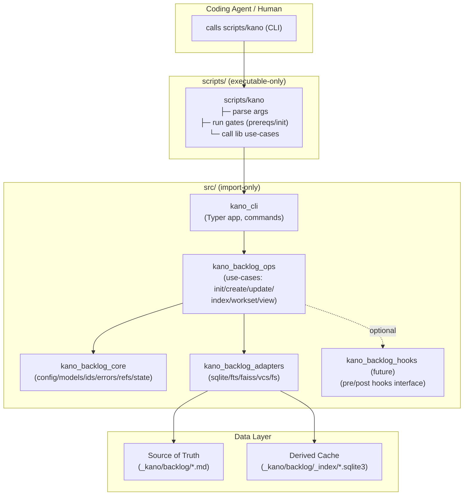
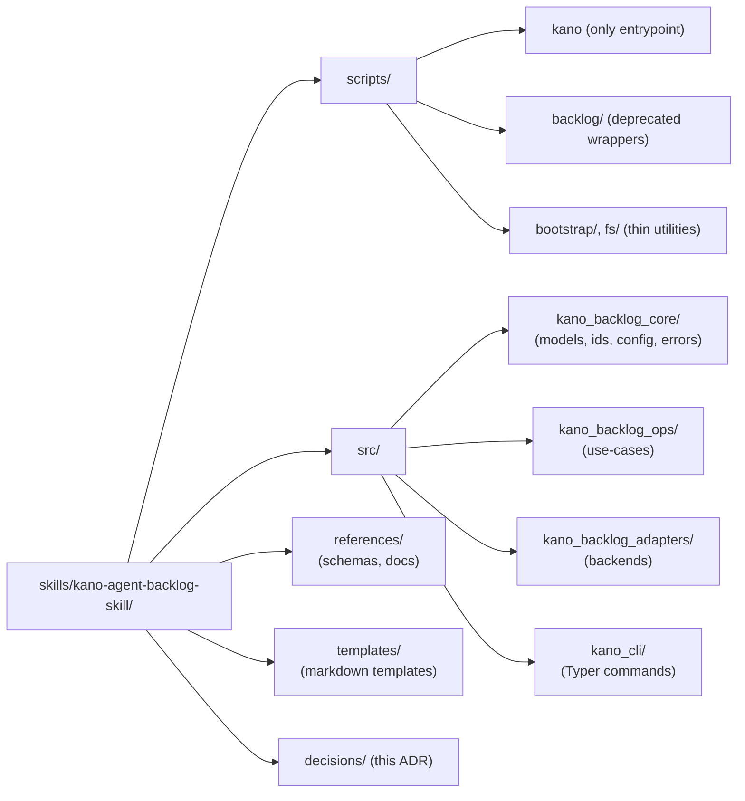

# Decision

Establish strict separation between **executable entrypoints** (`scripts/`) and **library modules** (`src/`). All agent-callable operations must go through a **single CLI entrypoint** (`scripts/kano`), which delegates to library use-cases.

## Hard Rules

1. **`scripts/` is executable-only**: No reusable module code in `scripts/`. Scripts must not be imported as libraries.
2. **Single CLI entrypoint**: Agents call only `scripts/kano <subcommand>`. All operations are exposed through this interface.
3. **`src/` is import-only**: Core logic lives in `src/kano_backlog_*` packages. These are imported by the CLI (and future facades), never executed directly.
4. **Consistent gating**: All write operations run prereqs + initialization checks via a single gate layer in the CLI.
5. **Deterministic output**: Same input state produces stable, reproducible output for views and queries.

# Context

## Current State (Problems)

The `scripts/` directory contains 40+ standalone Python scripts with overlapping responsibilities:

| Category | Scripts | Issues |
|----------|---------|--------|
| **backlog/** | 35+ scripts | Mixed executable + library code in same folder |
| **bootstrap/** | 1 script | OK |
| **indexing/** | 8 scripts | Some logic should be library code |
| **fs/** | 5 scripts | File operations, OK as thin wrappers |
| **vcs/** | 4 adapters | Already library-style but in scripts/ |
| **common/** | 4 modules | Shared code incorrectly placed in scripts/ |
| **logging/** | 3 modules | Shared code incorrectly placed in scripts/ |

**Problems**:
- Common logic mixed into scripts makes it hard to enforce consistent gating (prereqs/initialized/dry-run).
- Coding agents don't have a clear architecture reference; new code gets placed inconsistently.
- Different scripts may bypass checks or diverge behavior over time.
- No single entry point exists; agents must know which script to call.

## Existing Foundation

We already have:
- `src/kano_backlog_core/`: Core models, config, errors, refs, state (good foundation)
- `src/kano_cli/`: CLI skeleton with Typer, ~4 commands implemented
- `scripts/backlog/lib/`: Some shared code (should move to `src/`)
- `scripts/backlog/cli/`: Thin wrappers (good pattern, needs expansion)

# Architecture

## Layered Architecture



## Target Folder Structure



## Package Responsibilities

### `kano_backlog_core` (existing, expand)
- `models.py`: Pydantic models for work items, ADRs
- `config.py`: Configuration loading, defaults
- `ids.py`: ID parsing, generation, validation
- `errors.py`: Custom exceptions
- `refs.py`: Reference resolution logic
- `state.py`: State machine definitions
- `audit.py`: Audit logging primitives

### `kano_backlog_ops` (new)
Use-case functions that orchestrate operations:
- `init.py`: Initialize backlog structure
- `workitem.py`: Create, update, validate work items
- `adr.py`: Create, list ADRs
- `workset.py`: Workset management (init/refresh/promote)
- `view.py`: Generate views, dashboards
- `index.py`: Build/refresh SQLite index

### `kano_backlog_adapters` (new)
Pluggable backends:
- `fs.py`: File system operations (read/write markdown)
- `sqlite.py`: SQLite index adapter
- `fts.py`: Full-text search adapter
- `embedding.py`: Vector embedding adapter (optional)
- `vcs/`: VCS adapters (git, svn, perforce)

### `kano_cli` (existing, expand)
Typer-based CLI application:
- `cli.py`: Main app, callback for gating
- `commands/`: Subcommand modules (item, worklog, view, adr, index, workset)
- `util.py`: CLI utilities (output formatting, path resolution)

## CLI Command Structure (Implemented)

```
kano
├── doctor              # Check prereqs + initialization
├── backlog             # Backlog administration group
│   ├── init            # Initialize backlog structure
│   ├── index
│   │   ├── build       # Build SQLite index
│   │   └── refresh     # Refresh index (MVP: full rebuild)
│   ├── demo
│   │   └── seed        # Seed demo data for testing
│   ├── persona
│   │   ├── summary     # Generate persona activity summary
│   │   └── report      # Generate persona state report
│   └── sandbox
│       └── init        # Scaffold isolated sandbox environment
├── item
│   ├── create          # Create work item
│   ├── read            # Read item details
│   ├── update-state    # Transition state + worklog append
│   ├── validate        # Check Ready gate
│   └── create-v2       # Alias for create (compatibility)
├── state
│   └── transition      # Declarative state transitions
├── worklog
│   └── append          # Append worklog entry
├── view
│   └── refresh         # Refresh all dashboards
└── init (legacy)       # Alias for `backlog init` (deprecated)
```

# Migration Strategy

## Phase 0: ADR + SKILL Gate (This ADR)
- [x] Create this ADR with architecture diagrams
- [x] Update SKILL.md: skill developers must read ADR-0013 before coding

## Phase 1: CLI Skeleton ✅ COMPLETE
- [x] Expanded `src/kano_cli/commands/` to cover all high-frequency operations
- [x] Add `kano doctor` for prereqs/init checks
- [x] Implemented: item, state, worklog, view commands

## Phase 2: Library Migration ✅ COMPLETE
- [x] Created `src/kano_backlog_ops/` with use-case functions (init, workitem, adr, view, index, demo, persona, sandbox)
- [x] Created `src/kano_backlog_adapters/` for backend abstraction (partially)
- [x] Moved logic from `scripts/backlog/*.py` into library packages
- [x] Added backlog subcommand group with nested commands (index, demo, persona, sandbox)

## Phase 3: Deprecation ✅ COMPLETE
- [x] Deleted 70+ legacy scripts from `scripts/` directory
- [x] Updated all documentation to recommend `kano` CLI
- [x] Legacy `kano init backlog` aliased to `kano backlog init` with deprecation warning

## Phase 4: Future Extensions (Deferred)
- Plugin/hook system for external integrations
- Native engine option (C++/Rust via pybind11) for performance-critical paths
- HTTP/MCP server facade (reuses same `kano_backlog_ops` use-cases)

# Trade-offs

| Trade-off | Description |
|-----------|-------------|
| **Migration effort** | Significant refactoring of existing scripts. Mitigated by phased approach. |
| **Backward compatibility** | Old script paths break for agents. Mitigated by keeping thin wrappers. |
| **Initial complexity** | More packages to maintain. Pays off with clearer boundaries and reusability. |

# Consequences

1. **For skill developers**: Must read this ADR before adding code. New logic goes in `src/`, not `scripts/`.
2. **For agents**: Call only `scripts/kano-backlog`. Direct script calls are deprecated. See [[ADR-0015_skill-scoped-cli-namespace-convention]] for skill-scoped CLI naming convention.
3. **For future facades**: HTTP/MCP/GUI can import `kano_backlog_ops` directly, no CLI dependency.
4. **For testing**: Use-case functions in `src/` are easier to unit test than CLI scripts.
5. **Naming convention**: This skill follows skill-scoped naming (`kano-backlog`, `kano_backlog_*`). The bare `kano` namespace is reserved for a future umbrella CLI. See [[ADR-0015_skill-scoped-cli-namespace-convention]] for full rationale.

# Related

- [[../items/feature/0000/KABSD-FTR-0028_refactor-kano-agent-backlog-skill-scripts-into-a-single-cli-entry-library-modules.md]]: Parent feature for this refactoring
- [[KABSD-FTR-0025_unified-cli-for-backlog-operations]]: Unified CLI (subset of this work)
- [[KABSD-FTR-0019_refactor-kano-backlog-core-cli-server-gui-facades]]: Core/CLI/Server/GUI facades separation
- [[ADR-0004_file-first-architecture-with-sqlite-index]]: File-first architecture (complements this ADR)
- [[ADR-0015_skill-scoped-cli-namespace-convention]]: Skill-scoped CLI namespace convention (naming strategy)