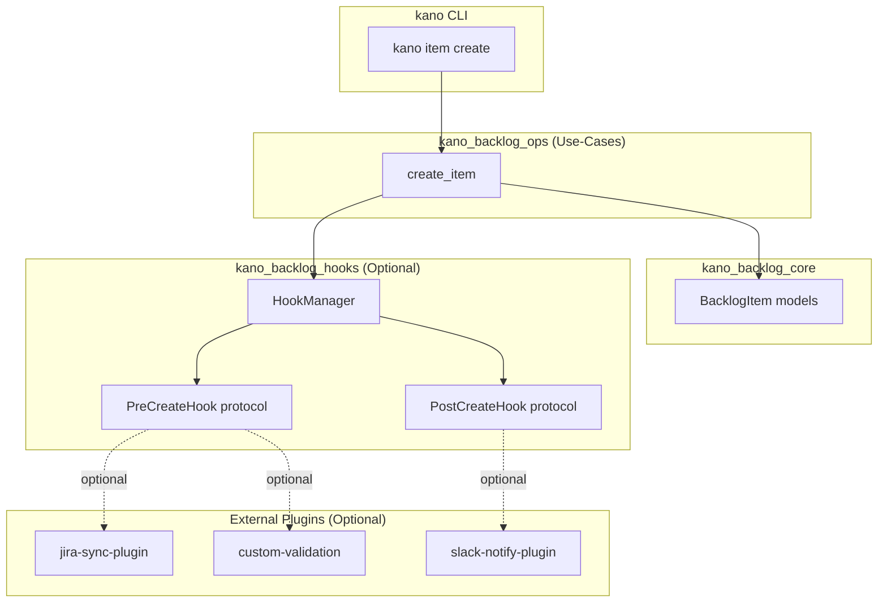

# Plugin and Hook System Architecture (Phase 4 - Deferred)

## Status

**Proposed** - Design documented for future implementation. Phase 4 is deferred until concrete integration needs emerge.

## Context

Per [ADR-0013](ADR-0013_codebase-architecture-and-module-boundaries.md) Phase 4, we anticipate future needs for:

1. **Pre/post hooks**: External projects may want to inject custom logic before/after backlog operations (e.g., notify external systems, run custom validations, sync with remote databases).

2. **Custom engines**: Performance-critical operations (workset retrieval, embedding search) may benefit from native (C++/Rust) implementations or external service integration.

3. **External tool integration**: Projects may want to bridge kano backlog operations with external systems (JIRA sync, Slack notifications, custom dashboards).

**Problem**: Hardcoding integrations into the core codebase violates separation of concerns and makes the skill harder to maintain.

**Current state**: As of Phase 1-3 completion, `kano_backlog_ops` provides a clean use-case layer, but no hook/plugin mechanism exists.

## Decision

### Design Principles

1. **Interface over Implementation**: Define stable contracts (Python protocols/abstract base classes) that plugins must implement.

2. **Registration-based Discovery**: Plugins register themselves via entry points or configuration files; no hardcoded imports.

3. **Fail-safe Defaults**: If a plugin fails to load or execute, the system continues with default behavior (log warning but don't crash).

4. **Optional Dependencies**: Core skill must function without any plugins installed.

### Proposed Architecture



### Hook Types

1. **Operation Hooks** (Pre/Post):
   - `PreCreateHook`: Validate/modify item before creation
   - `PostCreateHook`: Notify external systems after creation
   - `PreUpdateStateHook`: Block invalid state transitions
   - `PostUpdateStateHook`: Trigger workflows on state change

2. **Engine Replacements**:
   - `WorksetEngine`: Interface for workset retrieval (default: Python, optional: Rust/C++)
   - `EmbeddingSearchEngine`: Interface for ANN search (default: FAISS Python, optional: Qdrant/Milvus)
   - `IndexBuilder`: Interface for index construction (default: SQLite Python, optional: DuckDB)

### Plugin Discovery

**Option A: Entry Points** (Preferred for Python ecosystem)
```toml
# pyproject.toml of external plugin
[project.entry-points."kano_backlog.hooks"]
jira-sync = "jira_sync_plugin:JiraSyncHook"
```

**Option B: Configuration File**
```json
// _kano/backlog/.kano/plugins.json
{
  "hooks": {
    "post_create": ["jira_sync_plugin.JiraSyncHook", "slack.NotifyHook"]
  },
  "engines": {
    "workset": "workset_native.RustEngine"
  }
}
```

### Hook Protocol Example

```python
from typing import Protocol
from kano_backlog_core.models import BacklogItem

class PreCreateHook(Protocol):
    """Protocol for pre-creation hooks."""
    
    def execute(self, item: BacklogItem) -> BacklogItem:
        """
        Called before item creation.
        
        Args:
            item: Item about to be created (may be modified)
        
        Returns:
            Modified item (or original if no changes)
        
        Raises:
            HookVetoError: If hook rejects the operation
        """
        ...

class PostCreateHook(Protocol):
    """Protocol for post-creation hooks."""
    
    def execute(self, item: BacklogItem) -> None:
        """
        Called after item creation.
        
        Args:
            item: Newly created item (read-only)
        
        Note:
            This should not raise exceptions; log errors internally
        """
        ...
```

## Consequences

### Positive

- **Extensibility**: Projects can integrate custom logic without modifying skill core
- **Maintainability**: Core skill remains simple; complexity lives in plugins
- **Flexibility**: Users choose which plugins to install/enable
- **Ecosystem**: Encourages community-contributed integrations

### Negative

- **Complexity**: Hook system adds architectural overhead (discovery, error handling, versioning)
- **Testing burden**: Must test core with/without plugins, handle plugin failures gracefully
- **Documentation**: Need clear plugin development guide and hook lifecycle docs
- **Versioning**: Plugin API must be stable; breaking changes require migration path

### Risks

- **Performance overhead**: Hook execution adds latency to every operation
  - Mitigation: Make hooks optional, measure overhead, provide async execution
- **Security**: Malicious plugins could corrupt backlog or leak data
  - Mitigation: Sandboxing (future), plugin allowlist/blocklist, audit logging
- **Dependency hell**: Plugin A requires version X, plugin B requires version Y
  - Mitigation: Clear versioning policy, compatibility matrix

## Implementation Plan (When Needed)

### Phase 4a: Hook Interface (2-3 days)
1. Create `src/kano_backlog_hooks/` package with protocol definitions
2. Add `HookManager` class for discovery and execution
3. Update `kano_backlog_ops` to call hooks (with feature flag)
4. Write hook development guide

### Phase 4b: Engine Abstraction (3-5 days)
1. Define `WorksetEngine`, `EmbeddingSearchEngine` protocols
2. Refactor existing code to use default implementations
3. Add engine registry and discovery
4. Document engine replacement guide

### Phase 4c: Plugin Ecosystem (Ongoing)
1. Create example plugins (jira-sync, slack-notify)
2. Publish plugin template repository
3. Curate community plugins list

## Alternatives Considered

1. **No plugin system**: Rely on users forking the skill
   - Rejected: Makes upgrades difficult, fragments ecosystem

2. **Hardcoded integrations**: Add JIRA/Slack support directly
   - Rejected: Violates separation of concerns, bloats codebase

3. **HTTP webhooks only**: Use HTTP POST for all hooks
   - Rejected: Requires running server, adds network latency, no pre-hooks

4. **Monkey-patching**: Let users patch functions at runtime
   - Rejected: Fragile, hard to test, no contract enforcement

## References

- [ADR-0013](ADR-0013_codebase-architecture-and-module-boundaries.md): Establishes use-case layer that hooks will integrate with
- Python Entry Points: https://packaging.python.org/en/latest/specifications/entry-points/
- Protocol classes (PEP 544): https://peps.python.org/pep-0544/

## Revision History

- 2026-01-11: Initial proposal (copilot) - documented design for future Phase 4 implementation
