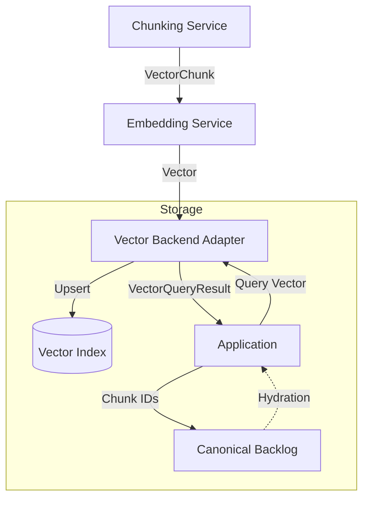

# Vector Backend Data Flow

This document details the data flow for the pluggable vector backend architecture.

## Stages

1.  **Preparation**: The backend is initialized with a schema (dimensions, metric).
2.  **Ingestion (Upsert)**:
    *   `Chunking Service` splits text into chunks.
    *   `Embedding Service` computes vectors for chunks.
    *   `Vector Backend Adapter` receives `VectorChunk` (id, metadata, vector) and upserts it into the backend.
3.  **Persistence**: The index state is saved to disk (for local-first backends).
4.  **Retrieval (Query)**:
    *   Application sends a query vector to the Adapter.
    *   Adapter performs similarity search and returns `VectorQueryResult` (chunk\_id, score).
5.  **Hydration**:
    *   Application uses `chunk_id` to retrieve full content from the canonical backlog (e.g., Markdown files) if needed.

## Key Principles

*   **Pluggable**: The backend implementation is swappable via configuration.
*   **Local-First**: Indices are storable as files within the product directory.
*   **Rebuildable**: The vector index is a derived artifact; it can be fully rebuilt from the canonical backlog Items.
